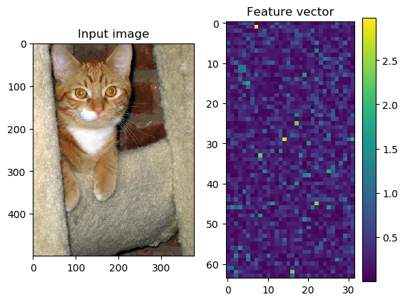

Welcome to Université Laval's CVSL PyTorch tutorial!

The goal of this tutorial is to give a quick overview of PyTorch to computer vision, graphics and machine learning researchers. It targets people already accustomed with basic neural network theory and with some other neural networks frameworks like Keras+Tensorflow, Theano, Caffe and the like. We cover the basic PyTorch features that allows tinkering, tweaking and understanding alongside inference and training.

This repository is a companion for a 90 minutes long presentation in an execute-along format for the attendees. Two datasets are used, MNIST (provided by `torchvision`) and the [Kaggle's Dogs vs Cats Redux](https://www.kaggle.com/c/dogs-vs-cats-redux-kernels-edition) dataset. Please download the dataset and unzip it in a folder called `./cats_and_dogs/`.

The proposed architectures are definitely *not* optimal for the given tasks, they are only presented for teaching purposes.

I highly recommend the very good [PyTorch examples of Justin Johnson](https://github.com/jcjohnson/pytorch-examples) to get an overview of all the rest offered in PyTorch, like custom layers, custom autograd functions, the optimizers, etc.

Summary
-------

Goals:

* Get you started with hands-on reusable examples
* Get you interested and hint you to the right places
* Examples are targeted for research on deep learning

Not (specifically) covered:

* (Multi-)GPU acceleration (just the basics)
* Custom layers
* Advanced stuff

Requirements
------------

All the examples were developed for PyTorch 1.2 on Python 3.7.

For the last examples, the [cats vs dogs redux](https://www.kaggle.com/c/dogs-vs-cats-redux-kernels-edition) dataset is needed.

List of examples
----------------

All the examples in presentation order:

* [Example 1](https://github.com/soravux/pytorch_tutorial/blob/master/example1.py): Pytorch's official MNIST example with slight modifications and annotations to explain during the presentation (data loading, network architecture and train/eval loop).
* Example 2: Getting the gradient and the features of the network.
  * [Example 2 (gradient)](https://github.com/soravux/pytorch_tutorial/blob/master/example2_gradient.py): How to set probes inside the network to obtain the gradient before the first FC layer as a Numpy array. Also shows how to modify the gradient during training.
  * [Example 2 (adversarial example)](https://github.com/soravux/pytorch_tutorial/blob/master/example2_adv_example.py): Get the gradient of the input. Subtracting this gradient to the input would generate an adversarial example. Out of the box, this example trains 2 epochs before displaying the gradients using Matplotlib, otherwise the displays are too random. Just input "continue" in `pdb` after the second epoch to begin the gradient display.
* [Example 3 (checkpointing)](https://github.com/soravux/pytorch_tutorial/blob/master/example3.py): Example 1 with checkpointing.
* [Example 4 (dynamic graph)](https://github.com/soravux/pytorch_tutorial/blob/master/example4.py): Simple example of dynamic graph execution, one major feature difference with other frameworks.
* [Example 5 (custom dataset)](https://github.com/soravux/pytorch_tutorial/blob/master/example5.py): Custom architecture derived from example 1 to work on the cats and dogs dataset. Obtains around 66% accuracy in a single epoch (~12 minutes on CPU).
* Example 6: Transfer learning
  * [Example 6 (ResNet-50)](https://github.com/soravux/pytorch_tutorial/blob/master/example6.py): Finetuning pretrained resnet-50 on the cats and dogs dataset. 95% accuracy in a single epoch (~30 minutes on CPU).
  * [Example 6 (SqueezeNet-1.1)](https://github.com/soravux/pytorch_tutorial/blob/master/example6_squeezenet.py): Finetuning pretrained squeezenet 1.1 on the cats and dogs dataset. 93% accuracy in a single epoch (~13 minutes on CPU).
  * [Example 6 (gradients)](https://github.com/soravux/pytorch_tutorial/blob/master/example6_gradient.py): How to set a backward hook to get gradients and foward hooks to get features on a pretrained network. Displays some gradients live using matplotlib.
  * [Example 6 (feature extractor)](https://github.com/soravux/pytorch_tutorial/blob/master/example6_features.py): Resnet-50 feature extractor on images loaded using PIL. Displays some features live using matplotlib.

Here is the output from `example6_features.py`:

Contributing
------------

You are welcome to propose pull requests to this repository on github!
